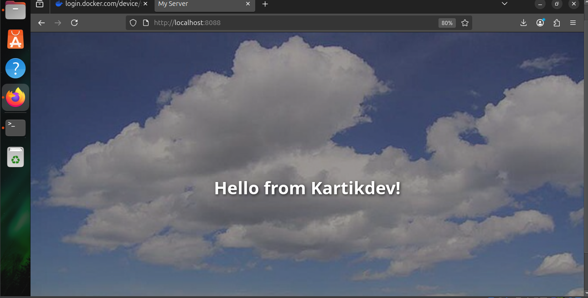

# 🚀 DevServer-app

A simple **Dockerized web application** deployed on Kubernetes (Minikube).  
The app displays a static HTML page: **"Hello from Kartikdev!"** 🎉

---

## 📝 Project Overview

This project demonstrates the end-to-end process of:

1. 🖥️ Creating a basic static web application.
2. 🐳 Containerizing it using Docker (Nginx).
3. ✅ Testing the container locally.
4. ☁️ Pushing the Docker image to Docker Hub.
5. ☸️ Deploying the containerized app on a local Kubernetes cluster using Minikube.
6. 🌐 Exposing the application via NodePort for browser access.

---

## 🧹 Cleanup Steps

After testing, you can clean up Docker and Kubernetes resources as follows:

### 🛠️ Kubernetes Cleanup
```bash
kubectl delete -f deployment.yaml
kubectl delete -f service.yaml
minikube stop

🐳 Docker Cleanup

Stop running containers:

docker ps           # list running containers
docker stop <container_id>
docker rm <container_id>


Remove images (optional):

docker rmi kartiksingh970/devserver-app:v1
docker rmi flask-dockerapp:latest
docker rmi localhost:5000/myapp:latest


Remove all unused images:

docker image prune -a

🌐 Accessing the Application

Locally via Docker:

http://localhost:<mapped_port>


Via Minikube Kubernetes Service:

minikube service devserver-service

## 🖼️ Screenshot of Running App



✍️ Author

Kartik Singh
